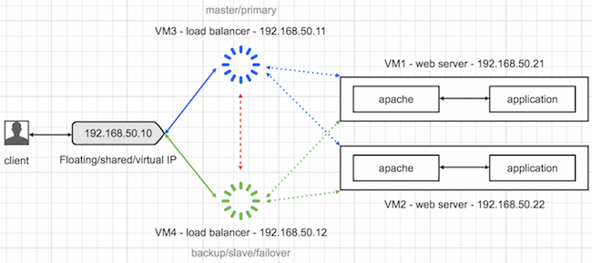

### VRRP Implementation via keepalived and HAProxy

This Layer4 load balancing project is based on an article by inanzzz.com. The Virtual Router Redundancy Protocol(VRRP) implementation on this particular project focusses on improvement for flexibility and depoyment methods. Rather than vagrant and virtualbox, we have adopted lxd virtual machine. 
Ref: http://www.inanzzz.com/index.php/post/ya4d/layer-4-load-balancing-two-different-web-servers-with-two-different-haproxy-servers-by-providing-high-availability-with-keepalived-in-vagrat
 

In this example, we are going to send a request to virtual IP, it will be diverted to one of the available Load balancers (HAProxy) then get the response from load balanced two different web servers. Request will never go to web servers directly. Load balancer will decide which server to be hit with the request. Example uses vagrant machines and is a layer 4 (transport layer) load balancing. Visit here for full configuration manual for you HAProxy version. We also be using Keepalived to make sure that HAProxy servers are up and running and the virtual IP is assigned to running server when one of them is down. It is Keepalived's responsibility.

Two web servers will have only apache running and the load balancer will have HAProxy plus Keepalived running. Load balancer GUI will be accessible from the host machine to see the health and stats about the web servers.

Note

This is a vagrant based example so if the Keepalived floating IP doesn't work as expected, it doesn't mean that it won't work as expected if you do everything manually on the servers so I suggest you to try installing packages manually on a fresh servers.

The project assumes you have set up macvlan profile on 2 machines and instances are able to ping each other accross the hosts.
Ref: https://blog.simos.info/how-to-make-your-lxd-container-get-ip-addresses-from-your-lan/

Create instances

    $ lxc launch ubuntu:22.04 lb-01 --vm --profile default --profile macvlan
    $ lxc launch ubuntu:22.04 lb-02 --vm --profile default --profile macvlan
    $ lxc launch ubuntu:22.04 web-01 --profile default --profile macvlan
    $ lxc launch ubuntu:22.04 web-02 --profile default --profile macvlan

Note: One of the challenges with macvlan method is that it relies on dhcp. So we are not able to predetermine the ips before the instances are set.
A method can be crafted to register and auto-feed back the resulting ips. This can allow for smoother automation of the next processes. The results can also be used to set up a dns server.

To do:
1. use cloud-init to set up the instances
1(a): use cloud-init to script how ip and hostname are fetched and relayed back to cb-controller and db
2. set up a dns server that can be used accross different physical hosts
3. develop one script that can implement all the following with appropriate parameters set (eg no of loadbalancers, number of load nodes)
4. script ansible project that can do this process
5. script how one can add a loadbalacer node
6. script how one can add a load node.

Create lb.sh

    #!/usr/bin/env bash
     
    # BEGIN ########################################################################
    echo -e "-- ---------- --\n"
    echo -e "-- BEGIN ${HOSTNAME} --\n"
    echo -e "-- ---------- --\n"
     
    # VARIABLES ####################################################################
    echo -e "-- Setting global variables\n"
    SYSCTL_CONFIG=/etc/sysctl.conf
     
    # BOX ##########################################################################
    echo -e "-- Updating packages list\n"
    apt-get update -y -qq
     
    # HAPROXY ######################################################################
    echo -e "-- Installing HAProxy\n"
    apt-get install -y haproxy > /dev/null 2>&1
     
    echo -e "-- Enabling HAProxy as a start-up deamon\n"
    cat > /etc/default/haproxy <<EOF
    ENABLED=1
    EOF
     
    echo -e "-- Configuring HAProxy\n"
    cat > /etc/haproxy/haproxy.cfg <<EOF
    global
        log 127.0.0.1 local0
        log 127.0.0.1 local1 notice
        daemon
        maxconn 2000
     
    defaults
        log global
        mode http
        option httplog
        option dontlognull
        retries 3
        option redispatch
        timeout connect 5000ms
        timeout client 50000ms
        timeout server 50000ms
     
    frontend http-in
        bind *:80
        default_backend webservers
     
    backend webservers
        mode http
        stats enable
        stats auth admin:admin
        stats uri /haproxy?stats
        balance roundrobin
        option httpchk
        option forwardfor
        option http-server-close
        server web-01 192.168.1.101:80 maxconn 32 check
        server web-02 192.168.1.105:80 maxconn 32 check
    EOF
     
    echo -e "-- Validating HAProxy configuration\n"
    haproxy -f /etc/haproxy/haproxy.cfg -c
     
    echo -e "-- Starting HAProxy\n"
    service haproxy start
     
    # KEEPALIVED ###################################################################
    echo -e "-- Installing Keepalived\n"
    apt-get install -y keepalived > /dev/null 2>&1
     
    echo -e "-- Allowing HAProxy to bind to the virtual IP address\n"
    grep -q "net.ipv4.ip_nonlocal_bind=1" "${SYSCTL_CONFIG}" || echo "net.ipv4.ip_nonlocal_bind=1" >> "${SYSCTL_CONFIG}"
     
    echo -e "-- Enabling virtual IP binding\n"
    sysctl -p
     
    echo -e "-- Configuring Keepalived\n"
    cat > /etc/keepalived/keepalived.conf <<EOF
    vrrp_script chk_haproxy {
        script "killall -0 haproxy"
        interval 2
        weight 2
    }
    vrrp_instance VI_1 {
        interface enp5s0            # This may be eth0
        state MASTER
        virtual_router_id 51
        priority ${PRIORITY}
        virtual_ipaddress {
            192.168.1.10
        }
        track_script {
            chk_haproxy
        }
    }
    EOF
     
    echo -e "-- Starting Keepalived\n"
    service keepalived start
     
    # END ##########################################################################
    echo -e "-- -------- --"
    echo -e "-- END ${HOSTNAME} --"
    echo -e "-- -------- --"

Instal and configure haproxy and keepalived (load balancer) in lb-01 and lb-02 lxd instances
WARNING: make sure you have the right setting for nic (eg eth1) and replace the {$PRIORITY} appropriately

    $ lxc file push webserver.sh web-01/tmp/
    $ lxc file push lb.sh lb-01/tmp/
    $ lxc exec web-01 -- sudo sh /tmp/webserver.sh 
    $ lxc exec lb-01 -- sudo sh /tmp/lb.sh
    $ lxc file push webserver.sh web-02/tmp/
    $ lxc file push lb.sh lb-02/tmp/
    $ lxc exec web-02 -- sudo sh /tmp/webserver.sh 
    $ lxc exec lb-02 -- sudo sh /tmp/lb.sh 

Create webserver.sh

    #!/usr/bin/env bash
     
    # BEGIN ########################################################################
    echo -e "-- ---------- --\n"
    echo -e "-- BEGIN ${HOSTNAME} --\n"
    echo -e "-- ---------- --\n"
     
    # VARIABLES ####################################################################
    echo -e "-- Setting global variables\n"
    APACHE_CONFIG=/etc/apache2/apache2.conf
    SITES_ENABLED=/etc/apache2/sites-enabled
    LOCALHOST=localhost
     
    # BOX ##########################################################################
    echo -e "-- Updating packages list\n"
    apt-get update -y -qq
     
    # APACHE #######################################################################
    echo -e "-- Installing Apache web server\n"
    apt-get install -y apache2 > /dev/null 2>&1
     
    echo -e "-- Adding ServerName to Apache config\n"
    grep -q "ServerName ${LOCALHOST}" "${APACHE_CONFIG}" || echo "ServerName ${LOCALHOST}" >> "${APACHE_CONFIG}"
     
    echo -e "-- Updating vhost file\n"
    cat > ${SITES_ENABLED}/000-default.conf <<EOF
    <VirtualHost *:80>
    	DocumentRoot /var/www/html
     
    	SetEnvIf Request_Method OPTIONS do-not-log-haproxy-ping
    	ErrorLog /var/log/apache2/error.log
    	CustomLog /var/log/apache2/access.log combined env=!do-not-log-haproxy-ping
    </VirtualHost>
    EOF
     
    echo -e "-- Adding a custom LogFormat to Apache config catch client's request IP\n"
    grep -q 'LogFormat "%{X-Forwarded-For}i %l %u %t \\"%r\\" %>s %b \\"%{Referer}i\\" \\"%{User-Agent}i\\"" combined' ${APACHE_CONFIG} || echo 'LogFormat "%{X-Forwarded-For}i %l %u %t \"%r\" %>s %b \"%{Referer}i\" \"%{User-Agent}i\"" combined' >> ${APACHE_CONFIG}
     
    echo -e "-- Restarting Apache web server\n"
    service apache2 restart
     
    # TEST #########################################################################
    echo -e "-- Creating a dummy index.html file\n"
    cat > /var/www/html/index.html <<EOD
    <html>
    <head>
    <title>${HOSTNAME}</title>
    </head>
    <body>
    <h1>${HOSTNAME}</h1>
    
Hi sir, I am going to serve you today!

    </body>
    </html>
    EOD
     
    # END ##########################################################################
    echo -e "-- -------- --"
    echo -e "-- END ${HOSTNAME} --"
    echo -e "-- -------- --"

Instal webserver in web-01 and web-02

    $ lxc file push webserver.sh web-01/tmp/
    $ lxc exec web-01 -- sudo sh /tmp/webserver.sh 
    $ lxc file push webserver.sh web-02/tmp/
    $ lxc exec web-02 -- sudo sh /tmp/webserver.sh 

Create Vagrantfile

    # -*- mode: ruby -*-
    # vi: set ft=ruby :
     
    Vagrant.configure("2") do |config|
        config.vm.box = "ubuntu/trusty64"
     
        # Configs for haproxy 1 (master)
        config.vm.define :lb-01 do |lb-01_config|
            lb-01_config.vm.provider :virtualbox do |vb_config|
                vb_config.name = "HAProxy 1 - lay4-lb-02-web-02"
            end
            lb-01_config.vm.hostname = "lb-01"
            lb-01_config.vm.network "private_network", ip: "192.168.1.100"
            lb-01_config.vm.provision :shell, path: "lb.sh", env: {"PRIORITY" => "101"}
        end
     
        # Configs for haproxy 2 (backup)
        config.vm.define :lb-02 do |lb-02_config|
            lb-02_config.vm.provider :virtualbox do |vb_config|
                vb_config.name = "HAProxy 2 - lay4-lb-02-web-02"
            end
            lb-02_config.vm.hostname = "lb-02"
            lb-02_config.vm.network "private_network", ip: "192.168.1.104"
            lb-02_config.vm.provision :shell, path: "lb.sh", env: {"PRIORITY" => "100"}
        end
     
        # Configs for web server 1
        config.vm.define :web-01 do |web-01_config|
            web-01_config.vm.provider :virtualbox do |vb_config|
                vb_config.name = "Web Server 1 - lay4-lb-02-web-02"
            end
            web-01_config.vm.hostname = "web-01"
            web-01_config.vm.network "private_network", ip: "192.168.1.101"
            web-01_config.vm.provision :shell, path: "webserver.sh"
        end
     
        # Configs for web server 2
        config.vm.define :web-02 do |web-02_config|
            web-02_config.vm.provider :virtualbox do |vb_config|
                vb_config.name = "Web Server 2 - lay4-lb-02-web-02"
            end
            web-02_config.vm.hostname = "web-02"
            web-02_config.vm.network "private_network", ip: "192.168.1.105"
            web-02_config.vm.provision :shell, path: "webserver.sh"
        end
    end

Access the machines

    # Server 1
    $ vagrant ssh web-01
    vagrant@web-01:~$
     
    # Server 2
    $ vagrant ssh web-02
    vagrant@web-02:~$
     
    # HAProxy 1
    $ vagrant ssh lb-01
    vagrant@lb-01:~$
     
    # HAProxy 2
    $ vagrant ssh lb-02
    vagrant@lb-02:~$

Verifying Keepalived Virtual IP

As you can see below, the virtual IP has been assigned to lb-01 which is master. Just pay attention to inet 192.168.1.10/32 scope global eth1. As you can see, it doesn't appear in lb-02 because it is backup.

HAProxy 1

    vagrant@lb-01:~$ sudo ip addr sh eth1
     
    3: eth1: <BROADCAST,MULTICAST,UP,LOWER_UP> mtu 1500 qdisc pfifo_fast state UP group default qlen 1000
        link/ether 08:00:27:79:c5:df brd ff:ff:ff:ff:ff:ff
        inet 192.168.1.100/24 brd 192.168.56.255 scope global eth1
           valid_lft forever preferred_lft forever
        inet 192.168.1.10/32 scope global eth1
           valid_lft forever preferred_lft forever
        inet6 fe80::a00:27ff:fe79:c5df/64 scope link
           valid_lft forever preferred_lft forever

HAProxy 2

    vagrant@lb-02:~$ sudo ip addr sh eth1
     
    3: eth1: <BROADCAST,MULTICAST,UP,LOWER_UP> mtu 1500 qdisc pfifo_fast state UP group default qlen 1000
        link/ether 08:00:27:17:29:f3 brd ff:ff:ff:ff:ff:ff
        inet 192.168.1.104/24 brd 192.168.56.255 scope global eth1
           valid_lft forever preferred_lft forever
        inet6 fe80::a00:27ff:fe17:29f3/64 scope link
           valid_lft forever preferred_lft forever

If you stop HAProxy server on lb-01, Keepalived will assign virtual IP to lb-02 so as a result inet 192.168.1.10/32 scope global eth1 will appear in lb-02 because it is master now. If you use sudo cat /var/log/syslog on both servers, you'll see master and backup state changes.

Tests

In normal life web servers must not be directly accessible but I ignore it for now for testing purposes. HAProxy servers are not accessible directly but the virtual IP we created with Keepalived will be used instead which is how it should be.

Web server 1

Response to request below will alway be the same.

    # Request
    http://192.168.1.101/
     
    # Response
    web-01
    Hi sir, I am going to serve you today!

Web server 2

Response to request below will alway be the same.

    # Request
    http://192.168.1.105/
     
    # Response
    web-02
    Hi sir, I am going to serve you today!

Load balancer

Response will always change because request is evenly shared between web servers. Load balancer does it!

    # Request
    http://192.168.1.10/
     
    # Response
    web-01
    Hi sir, I am going to serve you today!
     
    # Request
    http://192.168.1.10/
     
    # Response
    web-02
    Hi sir, I am going to serve you today!
     
    # Request
    http://192.168.1.10/
     
    # Response
    web-01
    Hi sir, I am going to serve you today!

System outage tests

Bring only web server 1 down

HAProxy will divert traffic to web-02 so system will still be up and running.

Bring only web server 2 down

HAProxy will divert traffic to web-01 so system will still be up and running.

Bring both web server 1 and 2 down

System will go down because we only have two application servers. As a result HAProxy will present error message below to clients. Default error message and template can be changed in HAProxy config file.

    503 Service Unavailable
    No server is available to handle this request.

Bring only haproxy 1 down

Keepalived will assign virtual IP to lb-02 and traffic will be handled by it so system will still be up and running.

Bring only haproxy 2 down

Keepalived will assign virtual IP to lb-01 and traffic will be handled by it so system will still be up and running.

Bring both haproxy 1 and 2 down

System will go down because we only have two load balancer servers.

Session handling

In web applications, user sessions are stored in temporary area in the server. If you're using load balancer, as we know user will be bounced to different server per request. In such cases, application won't be able to get session information of user from the current server and potentially he'll be logged out from the application so on. There are three options to solve this issue:

    Cookie-based Sessions: Session data is stored in browser's cookie. It has limitations such as amount of data a cookie can store. Also it exposes security issues such as it can be hijacked.

    Sticky Sessions/Session Affinity: This will ensure that given user will always be routed to same server for his subsequent requests. Web server saves session locally. The problem is sharing of work load between web servers is not really load balanced anymore but still better than the first option.

    Central Session Storage: Storing session data in Redis, memcached, database etc. Web servers will always connect to same storage so user session will always be available on which ever server user is routed to. This is the best solution.

Webserver logs

Keepalived pings HAProxy every 2 seconds then the request logs get added to Apache access.log file by default. This bloats the access.log file so to prevent recording such request logs, we modified /etc/apache2/sites-enabled/000-default.conf as shown below.

    SetEnvIf Request_Method OPTIONS do-not-log-haproxy-ping
    CustomLog /var/log/apache2/access.log combined env=!do-not-log-haproxy-ping

If a client sends a request to load balancer via http://192.168.1.10, request gets directed to one of the available web servers and the request is logged in access.log file as follows.

    192.168.1.100 - - [09/Jul/2016:13:22:52 +0000] "OPTIONS / HTTP/1.0" 200 180 "-" "-"
    192.168.1.104 - - [09/Jul/2016:13:22:53 +0000] "OPTIONS / HTTP/1.0" 200 180 "-" "-"
    192.168.1.100 - - [09/Jul/2016:13:22:54 +0000] "OPTIONS / HTTP/1.0" 200 180 "-" "-"
    192.168.1.104 - - [09/Jul/2016:13:22:55 +0000] "OPTIONS / HTTP/1.0" 200 180 "-" "-"

As you can see above, only HAProxy IP's are get recorded which can be useless in real life scenario. To get client's data, we added line below to /etc/apache2/apache2.conf.

    LogFormat "%{X-Forwarded-For}i %l %u %t \"%r\" %>s %b \"%{Referer}i\" \"%{User-Agent}i\"" combined

Now the request is logged in access.log file as follows.

    192.168.56.1 - - [09/Jul/2016:13:24:24 +0000] "GET / HTTP/1.1" 200 117 "-" "Mozilla/5.0 (Macintosh; Intel Mac OS X 10_10_3) AppleWebKit/537.36 (KHTML, like Gecko) Chrome/51.0.2704.103 Safari/537.36"
    192.168.56.1 - - [09/Jul/2016:14:42:44 +0000] "GET / HTTP/1.1" 200 117 "-" "Mozilla/5.0 (Macintosh; Intel Mac OS X 10.10; rv:47.0) Gecko/20100101 Firefox/47.0"

You can use sudo tail -f /var/log/apache2/access.log on each web server to see activities in real-time.

HAProxy Iogs

After stopping and starting HAProxy services on both servers, you'll see state logs in /var/log/haproxy.log file like below.

    # lb-01
     
    Jul 14 20:51:52 vagrant-ubuntu-trusty-64 Keepalived_vrrp[3026]: VRRP_Script(chk_haproxy) succeeded
    Jul 14 20:51:53 vagrant-ubuntu-trusty-64 Keepalived_vrrp[3026]: VRRP_Instance(VI_1) Transition to MASTER STATE
    Jul 14 20:51:54 vagrant-ubuntu-trusty-64 Keepalived_vrrp[3026]: VRRP_Instance(VI_1) Entering MASTER STATE
    Jul 14 20:53:06 vagrant-ubuntu-trusty-64 Keepalived_vrrp[3026]: VRRP_Instance(VI_1) Received lower prio advert, forcing new election
    Jul 14 21:01:36 vagrant-ubuntu-trusty-64 Keepalived_vrrp[3026]: VRRP_Script(chk_haproxy) failed
    Jul 14 21:01:38 vagrant-ubuntu-trusty-64 Keepalived_vrrp[3026]: VRRP_Instance(VI_1) Received higher prio advert
    Jul 14 21:01:38 vagrant-ubuntu-trusty-64 Keepalived_vrrp[3026]: VRRP_Instance(VI_1) Entering BACKUP STATE

    # lb-02
     
    Jul 14 20:53:05 vagrant-ubuntu-trusty-64 Keepalived_vrrp[2973]: VRRP_Script(chk_haproxy) succeeded
    Jul 14 20:53:06 vagrant-ubuntu-trusty-64 Keepalived_vrrp[2973]: VRRP_Instance(VI_1) Transition to MASTER STATE
    Jul 14 20:53:06 vagrant-ubuntu-trusty-64 Keepalived_vrrp[2973]: VRRP_Instance(VI_1) Received higher prio advert
    Jul 14 20:53:06 vagrant-ubuntu-trusty-64 Keepalived_vrrp[2973]: VRRP_Instance(VI_1) Entering BACKUP STATE
    Jul 14 21:00:38 vagrant-ubuntu-trusty-64 Keepalived_vrrp[2973]: VRRP_Script(chk_haproxy) failed
    Jul 14 21:01:18 vagrant-ubuntu-trusty-64 Keepalived_vrrp[2973]: VRRP_Script(chk_haproxy) succeeded
    Jul 14 21:01:38 vagrant-ubuntu-trusty-64 Keepalived_vrrp[2973]: VRRP_Instance(VI_1) forcing a new MASTER election
    Jul 14 21:01:39 vagrant-ubuntu-trusty-64 Keepalived_vrrp[2973]: VRRP_Instance(VI_1) Transition to MASTER STATE
    Jul 14 21:01:40 vagrant-ubuntu-trusty-64 Keepalived_vrrp[2973]: VRRP_Instance(VI_1) Entering MASTER STATE